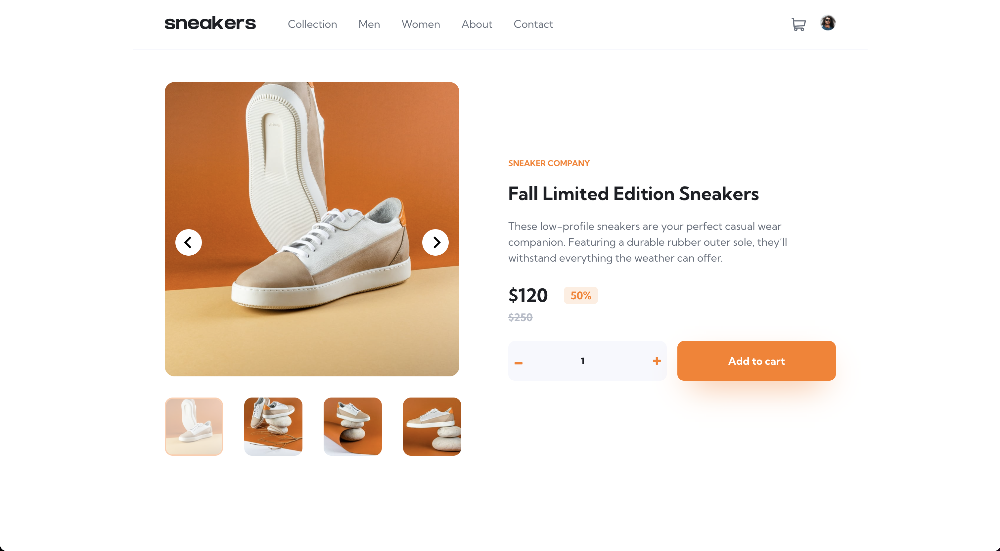

# PhilDL CSS Training - E-commerce product page solution

This is a solution to the [E-commerce product page challenge on Frontend Mentor](https://www.frontendmentor.io/challenges/ecommerce-product-page-UPsZ9MJp6). Frontend Mentor challenges help you improve your coding skills by building realistic projects.

## Table of contents

- [PhilDL CSS Training - E-commerce product page solution](#phildl-css-training---e-commerce-product-page-solution)
  - [Table of contents](#table-of-contents)
  - [Overview](#overview)
    - [The challenge](#the-challenge)
    - [Screenshot](#screenshot)
      - [Mobile](#mobile)
      - [Desktop](#desktop)
    - [Links](#links)
  - [My process](#my-process)
    - [Built with](#built-with)
    - [What I learned](#what-i-learned)
    - [Continued development](#continued-development)
  - [Author](#author)
  - [Acknowledgments](#acknowledgments)

## Overview

### The challenge

Users should be able to:

- View the optimal layout for the site depending on their device's screen size
- See hover states for all interactive elements on the page
- Open a lightbox gallery by clicking on the large product image
- Switch the large product image by clicking on the small thumbnail images
- Add items to the cart
- View the cart and remove items from it

### Screenshot

#### Mobile

#### Desktop

### Links

- Solution URL: [Repository](https://github.com/PhilDL/ecommerce-product-page)
- Live Site URL: [Demo](https://ecommerce-product-page-three.vercel.app/)

## My process

### Built with

- Semantic HTML5 markup (Tried, at least)
- CSS custom properties
- Flexbox
- Mobile-first workflow
- [React](https://reactjs.org/) - JS library
- [Reach UI](https://reach.tech/) - For Accessible Unstyled Modal
- [Styled Components](https://styled-components.com/) - For styles

### What I learned

This is training material for CSS and React.

### Continued development

Still not confortable with React and Styled Components, should practice more.

## Author

- Website - [Coding Dodo](https://codingdodo.com)
- Twitter - [@_philDL_](https://twitter.com/_philDL)

## Acknowledgments

Thanks to Josh from the [CSS For JS Dev course](https://courses.joshwcomeau.com/css-for-js) for this amazing ressource.
